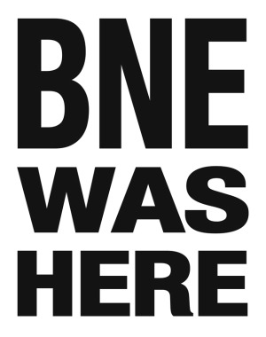

# BNE
an augmented reality app for street stickers

--

this is the open repo for BNE, an augmented reality app using the BNE WAS HERE sticker as a target image.

the goal of this project is to allow as many artists and programmers as possible to contribute to one existing Unity scene, so that, whenever someone pulls up their phone in front of a BNE sticker in any city, they will see one particular artwork taken from of a pool of many, many others.

we're using vuforia as the AR plug-in.

 This work is licensed under a <a rel="license" href="http://creativecommons.org/licenses/by-nc/4.0/">Creative Commons Attribution-NonCommercial 4.0 International License</a>.
